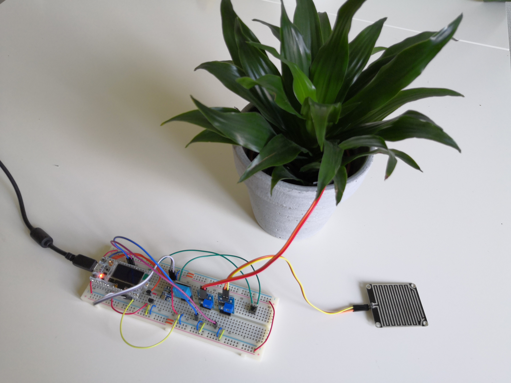

# Smart Soil Monitor

**Vilgot Ledstam (vl222nf)**



This is an IoT project with a soil monitor connected to a web dashboard, using several different environmental sensors to allow for estimates of water consumption of either a potted plant or an outdoor plant. It is connected to the Internet using WiFi, but could just as well have been connected using LoRa. This tutorial will describe how the project was carried out and how it can be replicated.

This project was done as part of the course "[1DT305 - Introduction to Applied IoT](https://lnu.se/en/course/introduction-to-applied-internet-of-things/distance-international-summer/)" at [Linnæus University](https://lnu.se/en/).

## Objective

Being able to track the water status of your plants would be very useful, would it not? It would be even more useful if you could see the typical rate of water consumption, and somehow determine in advance how much water your plants will consume based on weather forecasts. The next step would be to have an automatic or remotely controlled watering system.

I chose this project because it had been on my mind for a while because of my tendency to leave my apartment for longer periods as a student on distance. I generally tend to forget to water them even while being home, so even more reason.

Analyzing the measured data over long periods of time in combination with weather data (temperature, humidity, air pressure and rain intensity) could give a very accurate insight about your vegetation. It would not be limited to just house plants and gardening, it could also be applied for agriculture, forestry and general park management.

Of course there are already plenty of projects like this already in production, but this project shows how easily an individual could implement something like this for personal use.

## Material

The components used in this project are listed below. Their usage and where to buy them is also listed.

| Picture                                                        | Component                                                | Description                                                                                                                                                                                                                                                                                            | Can be bought from                                                                                                                                                                                                                                     |
| -------------------------------------------------------------- | -------------------------------------------------------- | ------------------------------------------------------------------------------------------------------------------------------------------------------------------------------------------------------------------------------------------------------------------------------------------------------ | ------------------------------------------------------------------------------------------------------------------------------------------------------------------------------------------------------------------------------------------------------ |
|  | Heltec WiFi LoRa 32 (V2) (w. pins and antenna)           | Microcontroller (MCU) with an [ESP32](https://en.wikipedia.org/wiki/ESP32) microprocessor.  Has a built-in 128x64 OLED display, a battery connector and a LoRa chip (with external antenna). Wireless capabilites include LoRa, WiFi, and Bluetooth (supports low energy). Requires soldering of pins. | [Amazon SE](https://www.amazon.se/gp/product/B08243JHMW/)                                                                                                                                                                                              |
|                            | Breadbord (full-size)                                    | Solderless breadboard with 840 connections and polarity indicators. A smaller sized board could suffice.                                                                                                                                                                                               | [Electrokit](https://www.electrokit.com/en/product/solderless-breadboard-840-tie-points-2/)                                                                                                                                                            |
|                               | Jumper wires                                             | Wires to connect sensor with MPU on the breadboard. Only male-male wires are required. Shorter length breadbord wires can also be used to reduce clutter.                                                                                                                                              | [AZ-Delivery](https://www.az-delivery.de/products/40-stk-jumper-wire-male-to-male-20-zentimeter)<br/>(40-pack, male-male),<br/>[AZ-Delivery](https://www.az-delivery.de/products/3er-set-40-stk-jumper-wire-m2m-f2m-f2f)<br/>(120-pack, various types) |
|                        | Soil moisture sensor (w. comparator module)              | Capacitive soil moisture sensor with a comparator module. A threshold can be set with the potentiometer on the comparator to provide a digital output, high or low, if the threshold is met or not. The comparator module also outputs the analog value directly.                                      | [Amazon SE](https://www.amazon.se/dp/B07V6SZYZW/)                                                                                                                                                                                                      |
|                                      | DHT11 temperature and humidity sensor                    | Temperature and humidity sensor with low precision, connected with GPIO. Only used for humidity in this project, since the barometer provides temperature measuring.                                                                                                                                   | [Amazon SE](https://www.amazon.se/dp/B089W8DB5P/)                                                                                                                                                                                                      |
|                          | BMP180 barometer                                         | A high precision barometer, with I2C interface. Also measures temperature. The unit used in this project requires soldering.                                                                                                                                                                           | [Amazon SE](https://www.amazon.se/dp/B07D8S617X/)                                                                                                                                                                                                      |
|                                 | (Optional)<br/>Rain sensor                               | Capacitive rain sensor, with identical comparator module as the soil moisture sensor. Only applicable for outdoor use, but still used in this project.                                                                                                                                                 | [AZ-Delivery](https://www.az-delivery.de/products/regen-sensor-modul)                                                                                                                                                                                  |
|                               | (Optional)<br/>NPN transistor or equivalent CMOS circuit | Used as a digital switch for the power supply, to save power and extend the lifespan of the capacitive sensors when not in use. A CMOS inverter constructed from NMOS and PMOS transistors are used in this project instead, simply because that is what I had on hand.                                | [Electrokit](https://www.electrokit.com/produkt/mpsa14-to-92-npn-30v-500ma/)                                                                                                                                                                           |

You will of course also need a USB-A to micro USB cable for programming and powering the Heltec board, but you probably already have one.

All sensors can be bought as a kit, the one I bought was from [AZ-Delivery](https://www.az-delivery.de/products/16-in-1-kit-zubehorset-fur-raspberry-pi-arduino-und-andere-mikrocontroller) (comes with additional sensors).

Any 3.7V battery with JST-PH connector could be used as power supply. Different capacity batteries can be bought from [Electrokit](https://www.electrokit.com/?s=lipo+3.7v&post_type=product)

I wanted to use a photoresistive sensor as well, to measure sunlight intensity, but the one I got from the kit was attached to a comparator module without analog output. I could have removed the resistor and used it separately, but I decided not to because I already had several sensors to deal with.

## Computer setup

### Code platform: MicroPython

It was recommended to use the [MicroPython](https://micropython.org/) as code platform, so I chose to use it for this project. MicroPython includes a modified subset of the Python standard library specifically tailored towards microprocessors. It is used with the Python language and allows for code to be run directly on the board without needing to compile, and has an interactive prompt that runs from the device.

The Heltec board needs to be flashed with the MicroPython firmware before any code can be uploaded. If you intend to use WiFi, you can use the latest official MicroPython binary for ESP32, downloaded from [here](https://micropython.org/download/esp32/). That page also has instructions on how to flash the device. LoRa is not included in this version because generic ESP32 devices do not have LoRa built in. If you want to use LoRa, you can use the [binary from PyCom](https://docs.pycom.io/updatefirmware/device/) instead, but other libraries may also differ from the official version.

If your operating system does not recognize the device, you can install the driver manually. It can be downloaded from [here](https://www.silabs.com/developers/usb-to-uart-bridge-vcp-drivers). Choose the latest version for your OS and run the installer unzipped from the download.

### IDE: Visual Studio Code

I chose to use [Visual Studio Code](https://code.visualstudio.com/) as IDE for the project since it is the one I am most familiar with and it has the [Pymakr](https://marketplace.visualstudio.com/items?itemName=pycom.Pymakr) extension available, which you need in order to upload code to the device and interact with it. I had some problem uploading code with Pymakr, so I switched to the [preview version](https://marketplace.visualstudio.com/items?itemName=pycom.pymakr-preview) of the extension which worked better. At one point I also tried to use [Atom IDE](https://atom.io/) with Pymakr extension, but I had worse problems there so I switched back.

You can download Visual Studio Code from [here](https://code.visualstudio.com/Download). In order to install the Pymakr plugin, open VS Code, click the "Extensions" icon in the side panel and search for "pymakr". I installed the preview version but the main might work as well.


<!-- Once installed, you will find the Pymakr icon in the side panel, which reveals the Pymakr options. You create a project by clicking "Create Project" or the + sign next to "Projects".


After selecting a directory where the project shall be located, you will be prompted to enter a project name and select a template.


Using the "empty" template will generate a ```boot.py``` and a ```main.py``` file, which you can see in the file view in the side panel. -->

When in the project folder, the project will show up in the Pymakr view. You will need to add the device to the project to be able to interact with it, by connecting it and clicking "ADD DEVICES" underneath the project.


If you have the correct driver installed it will show up as "Silicon Labs CP210x...". Simply select it and click "OK".


Hovering over the newly added device in the Pymakr view will reveal options for the device. You first click the connect icon to connect to the device. Then you will be able to upload the code by clicking the upload icon.


After the upload has finished, the new code can be run by clicking the reset button on the physical board (labelled "RST").

## Putting everything together

The image below shows the exact wiring I did with my sensors. The Heltec MCU is small enough to fit on the breadboard, but the pins had to be soldered onto it first. The barometer (BMP180) also required soldering of pins.

The temperature sensor (DHT11) has one digital data pin in the center which is connected to a pin on the MCU that supports bidirectional GPIO.

The barometer communicates over I2C, which requires 2 wires: one for data and one for a clock. The MCU already has dedicated pins for I2C since the OLED display also uses I2C, so I re-used those because.

The analog output pins of the comparator modules for the capacitive sensors (soil moisture and rain) are connected to one pin on the MCU each. Not all pins on the MCU have analog to digital converters so that had to be checked. The power lines for both of these is connected to a transistor switch, so that the power can be activated only when measuring. I had read that these types of sensors corrode very quickly if they are constantly powered, and they also consume a lot of power so I wanted to moderate that.

I used the pushbutton on the right side of the breadboard for debug purposes (sensing and publish data manually), so it is not required.

It is important that all sensors are connected to the 3.3V pins, even though some of them can operate on 5V. This is to save some power but also ensuring that nothing breaks on the MCU, since not all input pins can handle more than 3.3V. The digital connection to the board requires pull-up or pull-down resistors, but luckily the MCU has these built in and can easily be enabled in software.


*NOTE: In the diagram I added an NPN transistor as switch for the power supply, but in reality I used an NMOS and a PMOS transistor (forming a CMOS NOT gate). I am therefore not entirely sure if the wiring in the diagram is proper.*


To save energy I did as mentioned connect a switch to the capacitive sensors, but not to the others. The barometer has very low idle consumption so that is not a big problem, and the temperature sensor would get bad readings if not constantly powered.

The power consumption of the sensors are approximately the following:

| Component            | Active power | Standby/Idle |     |
| -------------------- | ------------ | ------------ | --- |
| DHT11                | 0.3 mA       | 60 µA        |     |
| BMP180               | 1 mA         | 3 µA         |     |
| Soil moisture sensor | 15 mA        | -            |     |
| Rain sensor          | 15 mA        | -            |     |

The processor on the Heltec board itself consumes a little more, especially when sending data. When in deepsleep, the power is very low however. The OLED display and power LED needs to be turned off.

| Component | Operating (w. WiFi on) | Deepsleep |
| --------- | ---------------------- | --------- |
| ESP32     | 160 ~ 260 mA           | 10 µA     |

If we assume that the device is active for about 10 seconds, including connecting to WiFi, gathering data for one second, transmitting and then going to sleep for 5 minutes minus the time spent awake, we get can calculate an approximated power consumption for the device, assuming also that the averaging consumption of the processor is 200mA.

$$
((0.3 + 1 + 15 + 15 + 200) + (0.06 + 0.003 + 200) * 9 + (0.06 + 0.003 + 0.01) * 290) / 300 = 6.843457
$$

So with an approximate consumption of 7 mA, a battery with 3000mAh capacity would last for about 430 hours or almost 18 days. There are of course ways to make things even more efficient, but it is a good start.

## Cloud platform

I chose to setup a cloud platform stack on my own device using [Docker](https://www.docker.com/). Using Docker containers is very handy when developing because it takes basically no time to set up if you have it preconfigured. The components I needed were:

- A MQTT broker that receives MQTT data sent from the device.

- A data collector that subscribes to the MQTT broker that stores the data in a database.

- A database storing all measurements within a certain time period.

- A data presenter with a web interface, for example showing graphs of the measured values over time.

### MQTT Broker: Mosquitto

As MQTT broker, I decided to use Mosquitto. It is a very reputable and open source platform that does the job. Users can be set up with read or write access to particular MQTT topics very easily using a single file.

### Data collector and data presenter: Node-RED

I chose to use Node-RED as data collector because it is very powerful and can operate as both data collector and data presenter, removing the need of yet another platform. It has a visual interface where "flows" are created with nodes that perform actions, such as collecting, filtering, modifying and visualizing data. It is perhaps not the most intuitive tool but it is very flexible and also has good integrations with both MQTT and InfluxDB. A dashboard extension can be installed and used to create a graphical UI without any knowledge of web programming.

### Database: InfluxDB

Influx is a high speed database that is very suitable for IoT. Tables are referred to as measurements and a measurement entry is divided into tag keys, that can describe where the data was measured, and fields, which contain the data itself. It has word-based quering, similar to SQL, which makes it easy to use. An easy pick for this type of project.

### Composing with Docker

All these platforms have official docker images. I created a composition file to make it easy to deploy and redeploy. I have my own domain pointed to my public IP address so that the MQTT data can be sent to me. However, my DNS provider does not allow all TCP ports, including 1883 for MQTT, so I had to use port 8080 instead. I set up volumes for the different containers so that the data would be saved even if I removed the containers. I provide a tutorial on how to setup and run my Docker composition in the GitHub repository of the project.

## The code

## Transmitting data

My initial goal was to use LoRa for the communication because it is very practical if it is used outdoors, since it does not require much power and it has a wide reach. There are different established LoRa networks that are basically free to use, for example The Things Network and Helium. After trying to connect to both of these networks without success, I concluded that LoRa would not work for my project without buying my own LoRa gateway.

I decided to use WiFi instead, and connect the device to my home network. MicroPython includes a library for WiFi which makes it easy to connect. All you have to do is set the device into station mode, connect with your credentials and wait until connected.

```python
import network

wlan = network.WLAN(network.STA_IF)
wlan.active(True)
wlan.connect("ssid", "password")
while not wlan.isconnected():
    pass
```

Since the device goes to deepsleep after each transmission, it needs to reconnect every time it wakes up, which takes up to 10 seconds. As mentioned, I use MQTT as transport protocol when sending the data. It has a very low overhead for the small amount of data it sends each cycle. I downloaded and imported [an MQTT library](https://github.com/micropython/micropython-lib/tree/master/micropython/umqtt.simple) that creates an MQTT client with both publishing and subscribing capabilites. You create a client with your broker information and your credentials, and you can then publish the data to a chosen topic. I had to provide a keepalive value or else my client would fail to connect.

```python
from mqtt.simple import MQTTClient, MQTTException

mqtt_client = MQTTClient(client_id=device_id, server=MQTT_SERVER, port=MQTT_PORT, user=MQTT_USER, password=MQTT_PASS, keepalive=60)

mqtt_client.connect()
mqtt_client.publish("/some/topic", 1337)
mqtt_client.disconnect()
```

When testing I used a cycle period of 5 minutes, but in a practical scenario I would reduce the measurements per hour to 2 or 4.

## Presenting data

## Finalizing the design
